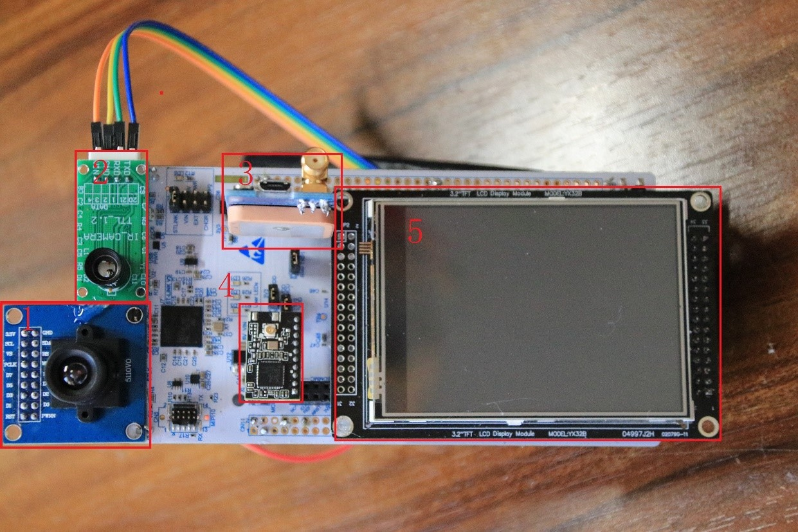

# 基于STM32的智慧公交系统
---
## 内容

- [应用领域](#1.应用领域)
- [主要技术特点](#2.主要技术特点)
- [关键性能指标](#3.关键性能指标)
- [整体介绍](#4.整体介绍)

## 1.应用领域

本智慧校园公交系统设计的初衷是应用于大学校园中的公交车 GPS 定位、车上实时人数信息的统计、通过人脸识别来简化乘车步骤减少接触以及通过热成像来判断温度是否在正常范围内来检测发热人群。当然其应用领域也可以包括但不仅限于此。在技术成熟的条件下，人们日常生活中的各种公共交通工具均可运用本系统 来实现交通工具的实时位置信息获取以及交通工具的人流密度信息统计，从而组建一个信息实时可查的智慧交通网络同时也能助力新冠疫情监控。人们通过手机联网便可获取最新的公共交通信息，使人们对公共交通的使用更加方便快捷，优化公共交通出行体验，提升出行效率和安全。

## 2.主要技术特点

本作品主控芯片采用了`STM32H743ZI`，其较为强大的处理能力可以完成本设计的任务。

### 2.1位置确定
将获取的GPS模块的原始数据通过串口传入MCU，并实时的解析数据，分析出有用的数据，实时更新校车数据。
### 2.2人脸识别
在摄像头模块旁边设计光电开关，设计为只有光电开关被触发后，调用摄像头进行画面捕捉。捕捉到的画面传输至服务器处理。
### 2.3Wi-Fi传输模块
Wi-Fi模块可以将所有获取到的数据通过网络传输到服务器，同时也可以接受服务器反馈回来的数据。
### 2.4热成像模块测温
通过一个热成像摄像头，获取前方人员的温度阵列，在通过算法获取平均探测温度，传给MCU判断是否存在异常温度。
### 2.5服务器端
在服务器端通过python脚本在局域网里通信，实现与MCU的通讯。再将数据处理后返回MCU。
### 2.6微信小程序
候车人员可以通过微信小程序获得当前车辆的位置和到站信息，非常便捷。

## 3.关键性能指标

|项目|指标|
| :----: | :---- |
|开发板主控 STM32H743ZI-C01|Flash储存器：1~2MB CPU：480 MHz Arm® Cortex®-M7内核|
|GPS-北斗双模定位 ATK1218-BD|波特率38400（默认，可调）通信协议：NMEA-0183 V3.01,  SkyTraq binary|
|Wi-Fi模块 C215|波特率15200Hz，支持WiFi协议及TCP/IP，UDP协议|
|光电开关 E3F-DS30C1|检测距离：0cm~30cm，工作电压：6-36V|
|摄像头 OV7670|感光阵列：640*480，接口协议：SCCB（兼容IIC）|
|红外阵列传感器 HTPA32x32dR2L5.0/0.85F7.7eHiC|工作电压：3.3V~3.6V，像素：32*32，数据接口：IIC，目标温度检测范围：-20~+1000℃|
|LCD显示屏 ILI9341|分辨率：240*RGB*320|

## 4.整体介绍
- 1为OV7670摄像头模块，通过DCMI与主板相接；
- 2为红外热成像模块，通过串口与主板连接；
- 3为GPS模块，通过串口与主板连接；
- 4为Wi-Fi模块，通过串口与主板连接；
- 5为LCD显示屏幕，实时显示信息，通过8080并行接口与主板连接。

  

## 5.代码结构
- `h743hussystem/Core/Inc`文件夹下为各个组件的头文件，如`GPS.h`、`LCD.h`……
- `h743hussystem/Core/Src`文件夹下为头文件对应的`.c`文件以及主函数`main.c`
- `h743hussystem/Drivers/OV7670`文件夹下为摄像头驱动代码
- `server/`文件夹下为服务器端python处理数据脚本，实现**数据库操作**和**人脸识别任务**
- `WechatProgram/`文件夹下为微信小程序端代码